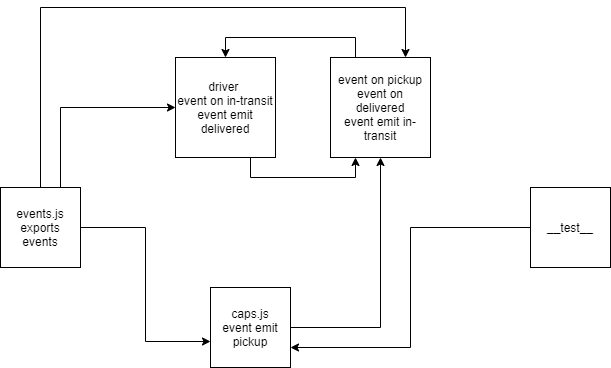

# caps

## LAB - 11

### Author: Ibrahem Sarayrah

### LINKS

* [github action]()

* [github action test]()

* pull request : 

### Setup

* **.env** requirements:
>
> STORENAME=test
>

### Running the app

>
> node caps.js
>

### LAB - 11 OUTPUT

[LAB-11-OUTPUT](img/lab-11-log.PNG)

### TEST

>
> npm test
>

### UML

