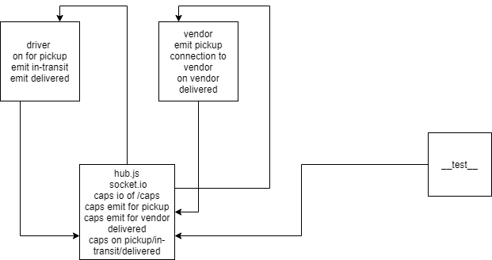

# caps

## LAB - 13

### Author: Ibrahem Sarayrah

### LINKS

* [github action](https://github.com/IbrahemSarayrah/caps/actions)

* [github action test](https://github.com/IbrahemSarayrah/caps/runs/3472846306)

* pull request : [Lab-11](https://github.com/IbrahemSarayrah/caps/pull/1)

* pull request : [Lab-12](https://github.com/IbrahemSarayrah/caps/pull/3)

* pull request : [Lab-13](https://github.com/IbrahemSarayrah/caps/pull/5)

### Setup

* **.env** requirements:
>
> STORENAME=test
>
> PORT=3000
>
> HOST=http://localhost:3000
>

### Running the app

>
> node queue-server/hub.js
>
> node modules/driver/driver.js
>
> node modules/vendor/vendor.js
>

### LAB - 11 OUTPUT

[LAB-11-OUTPUT](img/lab-11-log.PNG)

### LAB - 12 OUTPUT

[LAB-12-OUTPUT](img/lab-12.PNG)

### LAB - 13 OUTPUT

[LAB-13-OUTPUT](img/lab-13.PNG)

### TEST

>
> npm test
>

### UML

